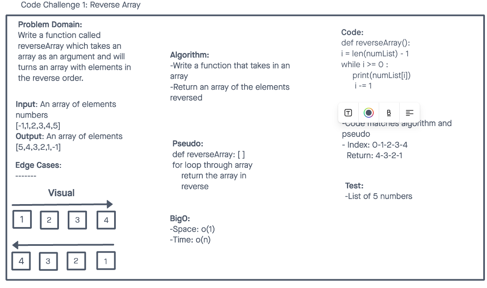

## Challenge:

# Reverse an Array

Write a function called reverseArray which takes an array as an argument and will turns an array with elements in the reverse order.

## Whiteboard Process

## Approach & Efficiency

Algorithm:
-Write a function that takes in an array
-Return an array of the elements reversed

## Solution

def reverseArray():
i = len(numList) - 1
while i >= 0 :
print(numList[i])
i -= 1
