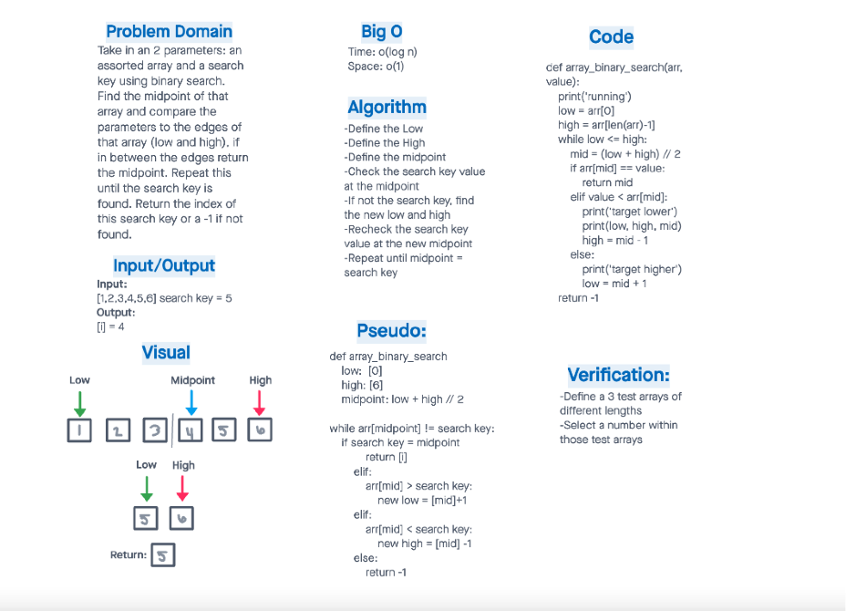

# array_binary_search

My Partner for this code challenge was Ian Cargill. (A new class partner list was sent out after Ian and I started working. Taylor was to work with Victor.)

# Use Binary Search To Find A Value In An Array

Take in an 2 parameters: an assorted array and a search key using binary search. Find the midpoint of that array and compare the parameters to the edges of that array (low and high), if in between the edges return the midpoint. Repeat this until the search key is found. Return the index of this search key or a -1 if not found.

## Whiteboard Process

## Approach & Efficiency

-Define the Low
-Define the High
-Define the midpoint
-Check the search key value at the midpoint
-If not the search key, find the new low and high
-Recheck the search key value at the new midpoint
-Repeat until midpoint = search key
