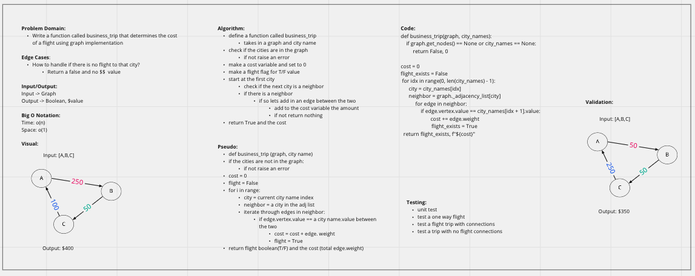

# Code Challenge: Class 37: Graph Business Trip

## Implementation: Graph
- Given a business trip itinerary, and an Alaska Airlines route map, is the trip possible with direct flights? If so, how much will the total trip cost be?

## Feature Tasks:
Write a function called business trip
Arguments: graph, array of city names
Return: cost or null
Determine whether the trip is possible with direct flights, and how much it would cost.

## Whiteboard:
 

# Approach & Efficiency:
- define a function called business_trip that takes in a graph and city name
- check if the cities are in the graph; if not raise an error
- make a cost variable and set to 0
- make a flight flag for T/F value
- start at the first city :: check if the next city is a neighbor
- if there is a neighbor :: lets add in an edge between the two
- add to the cost variable the amount
- return True and the cost
