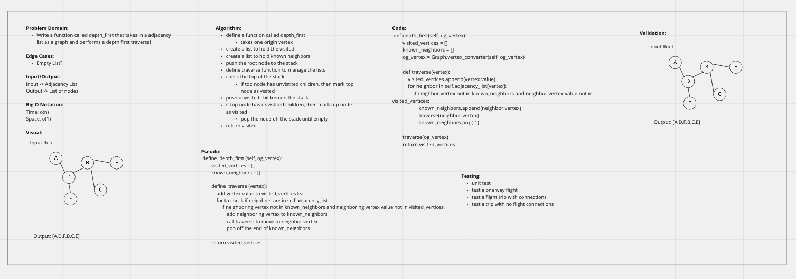

# Graphs

## Challenge
Implement your own Graph. The graph should be represented as an adjacency list, and should include the following methods:
- add node
- add edge
- get nodes
- get neighbors
- size

## Approach & Efficiency
Build out the mentioned methods above.

## API
No APIs used

## Code Challenge 38 Depth First
Write a function called depth_first that takes in a adjacency list as a graph and performs a depth first traversal

## Approach & Efficiency
- define a function called depth_first: takes one origin vertex
- create a list to hold the visited
- create a list to hold known neighbors
- push the root node to the stack
- define traverse function to manage the lists
- check the top of the stack::
if top node has unvistited children, then mark top node as visited
push unvisited children on the stack
if top node has unvistited children, then mark top node as visited
- pop the node off the stack until empty
return visited

## Whiteboard

## API
No APIs used
