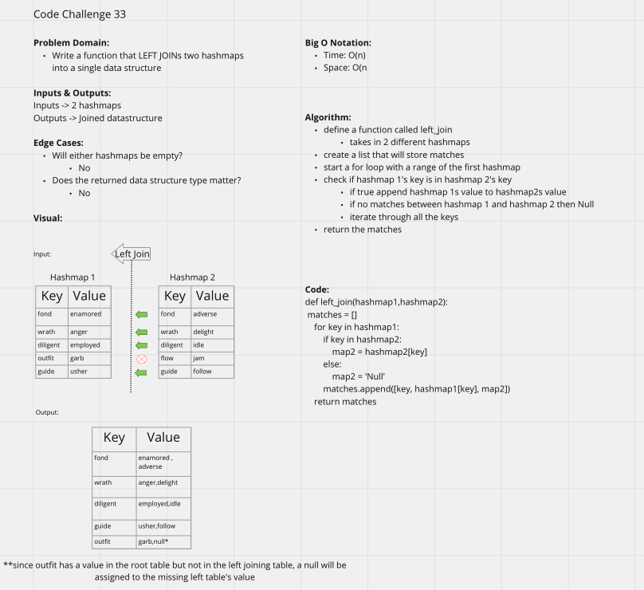

## Code Challenge: Hashmap Left Join

## Challenge:
 - Write a function that LEFT JOINs two hashmaps into a single data structure- Arguments: two hash maps
- The first parameter is a hashmap that has word strings as keys, and a synonym of the key as values.
- The second parameter is a hashmap that has word strings as keys, and antonyms of the key as values.
- Return: The returned data structure that holds the results is up to you. It doesn’t need to exactly match the output below, so long as it achieves the LEFT JOIN logic

## Approach & Efficiency:
- Define a function called left_join takes in 2 different hashmaps
- Create a list that will store matches
- Start a for loop with a range of the first hashmap
- Nest inside of that for loop another for loop with the range of the second hashmap
- Check if hashmap 1's key is in hashmap 2's key
- If true append hashmap 1s value to hashmap2s value
- If no matches between hashmap 1 and hashmap 2 then Null
- Iterate through all the keys
- Return the matches

## Solution:
Please see (hashmap_left_join.py)
