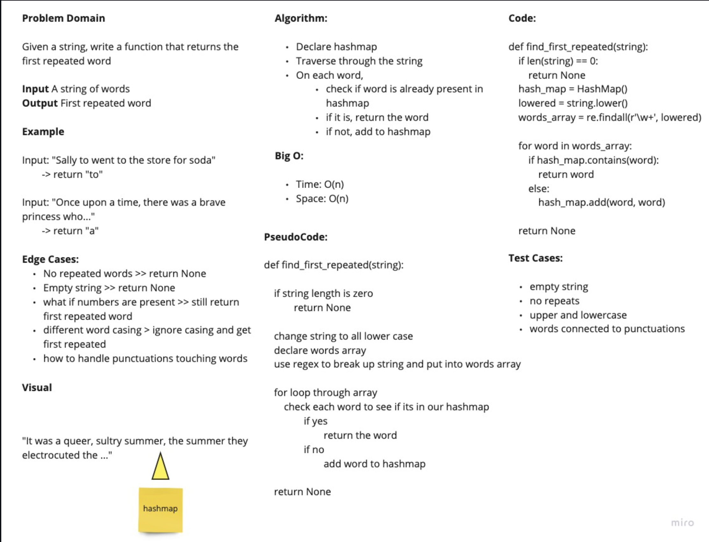

## Code Challenge 31
# Hashmap Repeated Word

- Write a function called repeated word that finds the first word to occur more than once in a string
Arguments: string
Return: string

## Whiteboard

## Approach & Efficiency
- take in a string
- instanciate a hashtable
- lower case all the letters in the string
- section off pieces of the string to isolate the letters
- add the individual words to the hashmap

## Solution
See hashmap_repeated_word.py
