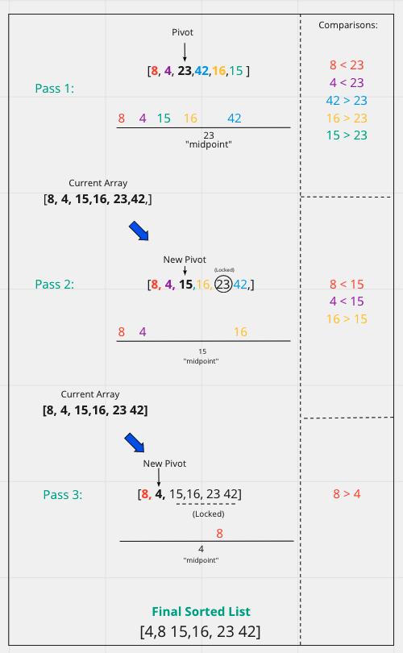

# Quick Sort

## Pseudo Code
    ALGORITHM QuickSort(arr, left, right)
        if left < right
            // Partition the array by setting the position of the pivot value
            DEFINE position <-- Partition(arr, left, right)
            // Sort the left
            QuickSort(arr, left, position - 1)
            // Sort the right
            QuickSort(arr, position + 1, right)

            ALGORITHM Partition(arr, left, right)
                // set a pivot value as a point of reference
                DEFINE pivot <-- arr[right]
                // create a variable to track the largest index of numbers lower than the defined pivot
                DEFINE low <-- left - 1
                for i <- left to right do
                    if arr[i] <= pivot
                        low++
                        Swap(arr, i, low)

                // place the value of the pivot location in the middle.
                // all numbers smaller than the pivot are on the left, larger on the right.
                Swap(arr, right, low + 1)
                // return the pivot index point
                return low + 1

            ALGORITHM Swap(arr, i, low)
                DEFINE temp;
                temp <-- arr[i]
                arr[i] <-- arr[low]
                arr[low] <-- temp

## How it works:
Quick Sorts is a Divide and Conquer Algorithm. Basically it picks a certain element as what is called the PIVOT. The pivot is then used as a middle point for comparison of its left and its right. All values less than the pivot are sorted to the left all values larger than the pivot are sorted to the right. Once we have cycled through all the values with this pivot point we lock that value as the midpoint. This process is repeated with both the left and right side of the pivot value to be sorted. A new pivot is chosen for each left and right sub-array and the process is repeated with then new pivot as the middle point.

## Example Walk Through
Given this list:
[8,4,23,42,16,15]

